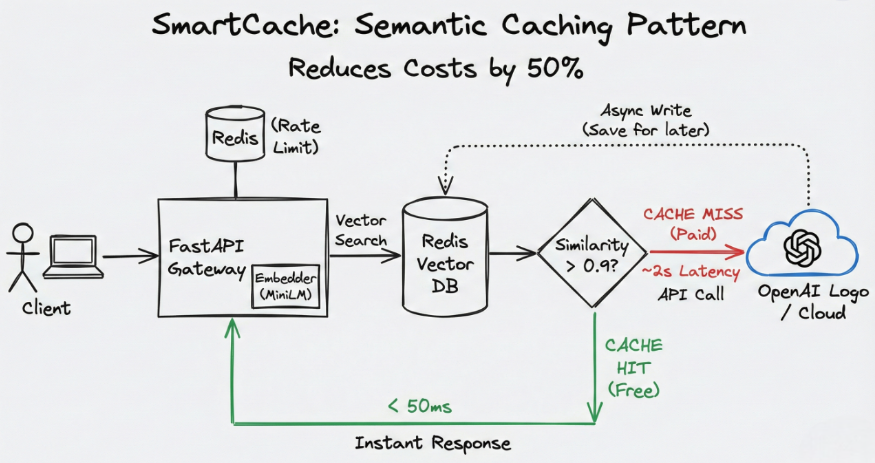

# SmartCache: Distributed Semantic Caching & Gateway for LLMs 🚀

**SmartCache** is a production-grade API Gateway designed to optimize Large Language Model (LLM) inference. It acts as an intelligent middleware between your application and providers like OpenAI or Anthropic.

Instead of blindly forwarding every request, SmartCache intercepts calls and performs a **Semantic Vector Search** against a Redis database. If a semantically similar question has been asked before, it returns the cached response in **<50ms**, bypassing the slow and expensive LLM API entirely.

---

## ⚡ Key Capabilities

* **💰 Cost Efficiency:** Reduces API bills by up to 50% by serving cached responses for recurring queries.
* **🚀 High Performance:** Lowers latency from ~2s (OpenAI) to ~20ms (Redis Cache).
* **🧠 Semantic Understanding:** Uses Cosine Similarity (via `sentence-transformers`) to detect similar intent (e.g., "Reset password" vs. "How to change password").
* **🛡️ Robust Engineering:** Features a custom **Token Bucket Rate Limiter** implemented in **Lua** for atomic distributed counting.
* **🔄 Automatic Failover:** Includes circuit-breaker logic to route traffic to a fallback model (e.g., Llama 3) if the primary LLM provider is down.
* **📈 Scalable:** Fully containerized with Docker and ready for Kubernetes horizontal scaling.

---

## 🏗️ Architecture

🛠️ Tech Stack
Backend: Python, FastAPI (Async/Await)

Database: Redis Stack (Vector Store + Cache)

AI/ML: Sentence-Transformers (all-MiniLM-L6-v2)

DevOps: Docker, Docker Compose, Kubernetes (AKS/EKS ready)

Observability: Prometheus Metrics

🚀 Quick Start
Prerequisites
Docker & Docker Compose

1. Clone the Repository
Bash

git clone [https://github.com/your-username/smart-cache-llm-gateway.git](https://github.com/your-username/smart-cache-llm-gateway.git)
cd smart-cache-llm-gateway
2. Run with Docker Compose (Dev Mode)
Bash

docker-compose up --build
The API will be available at http://localhost:8000.

3. Test the API
Send a request (Cache Miss):

Bash

curl -X POST "http://localhost:8000/chat" \
     -H "Content-Type: application/json" \
     -d '{"prompt": "What is the capital of France?", "user_id": "test_user"}'
Response Source: openai (Simulated)

Send a similar request (Cache Hit):

Bash

curl -X POST "http://localhost:8000/chat" \
     -H "Content-Type: application/json" \
     -d '{"prompt": "Tell me the capital of France", "user_id": "test_user"}'
Response Source: cache (Latency Saved: High)

Note for Windows PowerShell Users: Use Invoke-RestMethod instead of curl.

☸️ Kubernetes Deployment (Scaling)
The project includes manifest files for deploying to a Kubernetes cluster with 3 replicas for high availability.

Bash

# Apply Manifests
kubectl apply -f k8s/

# Verify 3 replicas are running
kubectl get pods

# Forward port for local testing
kubectl port-forward service/smartcache-service 8080:80

📂 Project Structure
Plaintext

smart_cache_gateway/
├── app/
│   ├── services/
│   │   ├── cache_service.py   # Vector Search Logic (Redis)
│   │   ├── rate_limiter.py    # Lua-based Token Bucket
│   │   └── llm_service.py     # LLM Provider Abstraction & Failover
│   ├── models/                # Pydantic Schemas
│   ├── main.py                # API Entry Point
│   └── config.py              # Environment Variables
├── k8s/                       # Kubernetes Manifests
├── docker-compose.yml
├── Dockerfile
└── requirements.txt

🧠 Hard Engineering Challenges Solved
1. Concurrency Control with Lua
Implemented a Token Bucket algorithm using Redis Lua Scripts. This ensures that rate limit checks are atomic (check-and-decrement in one step), preventing race conditions even when running multiple API replicas.

2. Non-Blocking Writes
Using FastAPI Background Tasks, the system updates the vector cache after the response is returned to the user. This ensures the user never pays the latency penalty for our indexing operations.

3. Resilience & Failover
The LLMService includes a chaos-testing simulation. If the primary provider (OpenAI) throws a 5xx error, the gateway automatically reroutes traffic to a fallback model (Llama 3/Local) without dropping the user's request.